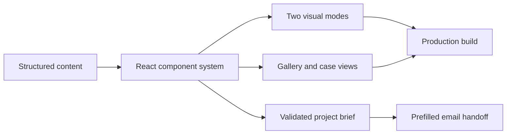

# FORMALAB PRO

Production frontend for a custom furniture and architectural millwork studio.

[Live product](https://formalabpro.tech/) ·
[Source repository](https://github.com/Tonivecher/FORMALABPRO)


## Why it exists

Complex custom furniture needs more than a gallery. The product presents
finished work, materials, engineering process and project constraints, then
turns that context into a structured client brief.

## Product proof

- Production interface for desktop and mobile.
- Project gallery with category filtering and detailed case views.
- Dark and light visual modes built as separate component families.
- Client-side project brief validation and prefilled email handoff.
- SEO metadata, Open Graph data, sitemap, robots rules and JSON-LD.
- Reduced-motion and keyboard-accessible interaction paths.

## How it works



The application is intentionally frontend-only. Content lives in typed data
modules, shared behavior lives in hooks and utilities, and the two visual modes
reuse the same product information without forcing one component template.

## Stack

- React 19 and TypeScript
- Vite and Tailwind CSS
- Framer Motion
- Lenis smooth scrolling
- ESLint and TypeScript build checks

## Run locally

```bash
npm install
npm run dev
```

Production build:

```bash
npm run lint
npm run build
```

## Verification snapshot

Verified from an isolated source checkout on 31 July 2026:

- `npm run lint` — passed
- `npm run build` — passed
- live production endpoint — HTTP 200

This repository does not claim a backend, CRM integration or automated product
test suite.

## Role

Product framing, frontend architecture, interaction design, responsive
implementation, content structure, production build and deployment handoff.

## Usage

Source code and original project materials are presented for portfolio review.
No open-source license is granted by this README. Third-party and client media
remain subject to their respective rights.

[Rights and permitted use](RIGHTS.md)
